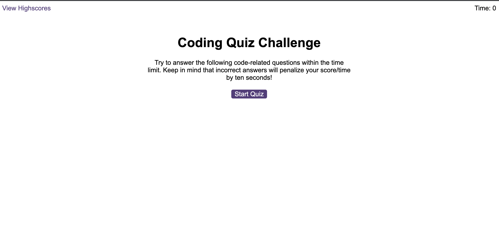
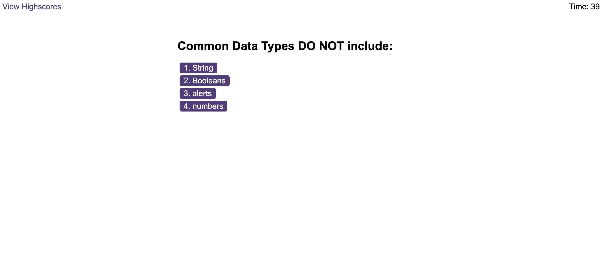
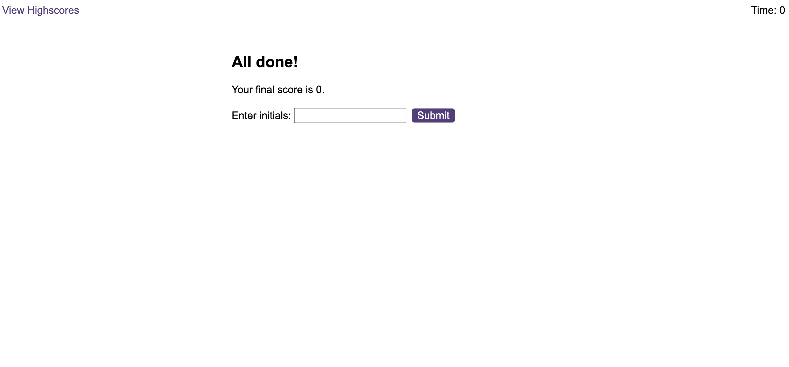

# Code-Quiz

A short coding quiz made using JavaScript, CSS and HTML.

## Description

The aim of this project was to create a functional coding quiz that would have a timer feature and a highscores section.

## Usage

A short quiz was made using JavaScript, CSS and HTML. The purpose of this coding quiz is to test the users knowledge of coding, then store their highscores on a scoreboard. The quiz consists of three questions. If the user selects the wrong answer 15 second are deducted from the timer feature, a sound is triggered and the message "Wrong!" appears. Moreover, if the answer is correct a specific sound is chimed and the word "Correct!" appears on the screen. The user will score a higher score if they answer the questions correctly, and answer quickly. Scores are stored in the highscores section, however the user is able to clear the scores from the scoreboard if desired.

## License

Code-Quiz is licensed under the MIT license.

## Installation

To play the Code-Quiz please open the link in your browser. To begin the quiz the user must select "Start Quiz." After pressing this button the questions will appear and the timer will begin to countdown. For each question there is one correct answer. Once the user has finished the quiz, they are prompted to enter their initials. Lastly, the user is directed to the highscores page.

## Deployed webpage link
